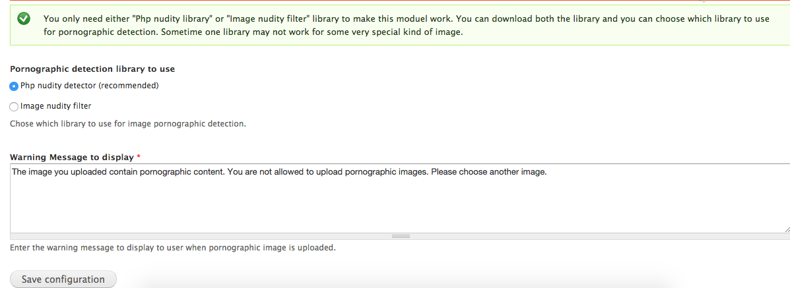
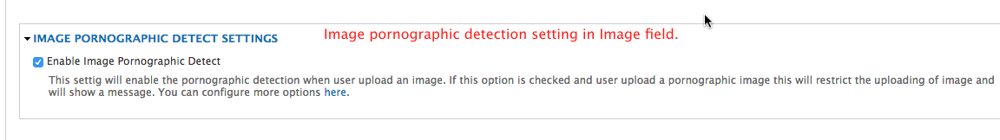
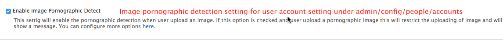

### Image pornographic detect

A simple drupal module which allow site administrator to configure image field to not allow pornographic image upload.
This module uses two third party libraries:
- [Php nudity detector](https://github.com/FreebieStock/php-nudity-detector)
- [Image nudity filter](http://www.phpclasses.org/package/3269-PHP-Determine-whether-an-image-may-contain-nudity.html)

Admin interface of module allow which library to use for pornographic detection.

##### @todo
~~Porn image detect for user profile.~~

Dependencies:
[Libraries API](https://www.drupal.org/project/libraries)

**Steps**


- Download and extract module under `sites/all/modules`
- Download and extract `Libraries` module.
- Download **one of the library or both.**
  - [Php nudity detector](https://github.com/FreebieStock/php-nudity-detector) (recommended)
  - [Image nudity filter](http://www.phpclasses.org/package/3269-PHP-Determine-whether-an-image-may-contain-nudity)
- Extract and put the library under `sites/all/libraries/` and make sure path is `sites/all/libraries/php-nudity-detector` (for php nudity detector library) and `sites/all/libraries/image-nudity-filter` (for Image nudity filter library).
- Enable the module and configure any `image field` added in content type and check the pornograhpic detection option.

#### Settings

- **Admin setting**
  

- **For image field**
  

- **User profile picture setting**
  

#### Known issue
**IF you use Image nudity filter library.**
Notice: imagecolorat(): 1,400 is out of bounds in ImageFilter->GetScore() (line 62 of class.ImageFilter.php).

**Solution:**
After downloading [Image nudity filter](http://www.phpclasses.org/package/3269-PHP-Determine-whether-an-image-may-contain-nudity) edit ImageFilter->GetScore() method in class.ImageFilter.php file at line 58 and 60 change `less then or equal <=` operator to `less then <` operator.

Change:

```php
for($i=1; $i<=$x; $i++)
{
    for($j=1; $j<=$y; $j++)
    {

```
to:

```php
for($i=1; $i<$x; $i++)
{
    for($j=1; $j<$y; $j++)
    {

```